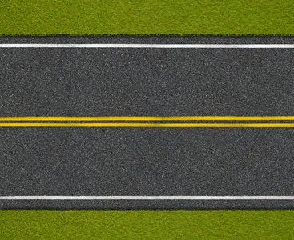

# Hough-Transform
This repository contains the code of implementation of Hough Transform

For this question, I implemented the Hough transform from scratch with Python and NumPy. The first function of the code (hough_lines_acc) creates the Hough accumulator. It creates the Hough space and adjusts its resolution. After that, it votes every point in that space. If there is a line in the image, it creates a center-like-point on the Hough space. So, that point will get more votes because every point in the line votes that point one. In this way, we can understand that in which pixels we have a line. The second function(hough_peaks) does that. It gets the maximum values from the Hough space. Then thresholds these values and gets “n” of them. It picks the most powerful lines and returns their indexes. The final function (hough_lines_draw) draws the lines onto the original image. It gets the indexes from the second function and puts the lines on the original image by using these indexes. For some cases, a blurring filter can be applied to the original image before the extraction of edges. It clears some noise but in my case, it causes negative results. Some week lines disappear when I apply a gaussian blur. For noisy images gaussian blur or median filter can be applied to the image and in some other cases for example on a very blurry image, sharpening filters can be very useful to robust to the system.   Input and Result

   
  
